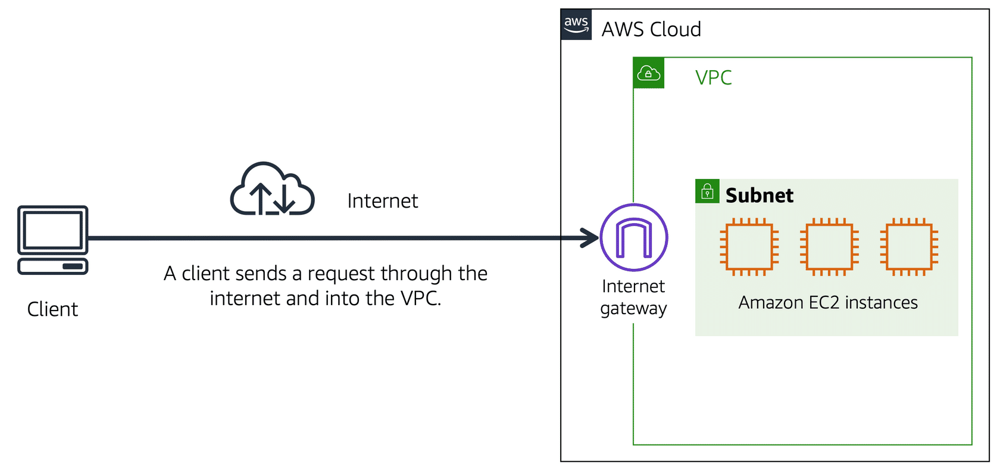

# AWS Certified Cloud Practitioner

## 1. Danh sách các dịch vụ cơ bản của AWS

------------------------------
### EC2: Virtual machine

1. Types:
   1. **General purose** instances: **balance** of computer, memory, and network resources.
   2. **Compute optimized** instances: **high-performance processors**.
   3. **Memory optimized** instances: are designed to deliver fast performance for workloads that process **large datasets in memory**.
   4. **Accelerated computing** instances: use hardware accelerators, or coprocessors, to perform some functions more efficiently than is possible in software running on CPUs. Examples of these functions include **floating-point number calculations, graphics processing, and data pattern matching**.
   5. **Storage optimized** instances: are designed for workloads that require high, sequential read and write access to **large datasets on local storage**.

2. Pricing:
   1. **On-Demand** instances: for short-term and you pay for only the compute time you use.
   2. **Savings Plans** instances: enable you to reduce your compute costs by **committing to a consistent amount of compute usage for a 1-year or 3-year term**. Savings of up to 66% over On-Demand costs.
   3. **Reserved** instances: cam kết 1 hoặc 3 năm, sẽ ưu đãi tới 75% các dịch vụ đám mây AWS. Các doanh nghiệp quan tâm đến chi phí hạ tầng đám mây thường sử dụng cách này.
   4. **Spot** instances: are available at up to a 90% discount compared to On-Demand prices. Terminate after 2 minute alert.
   5. **Dedicated Hosts** : physical servers with Amazon EC2 instance capacity that is fully dedicated to your use. 

### S3: Simple Storage Service

1. Classes:
   1. **S3 Standard** : **high durability, availability, and performance** object storage for frequently accessed data. [**General purpose**]
   2. **S3 Intelligent-Tiering** : automatically reduces your storage costs on a granular object level by automatically moving data to the most cost-effective access tier based on access frequency.[**Unknown or changing access**]
   3. Infrequent access [Truy cập không thường xuyên]
      1. **S3 Standard-IA**: S3 Standard-Infrequent Access => data that is accessed less frequently, but requires rapid access when needed. [Truy cập không thường xuyên tuy nhiên truy cập nhanh]
      2. **S3 One Zone-Infrequent Access**: Same Standard-IA, but stores data in a single zone and costs 20% less than S3 Standard-IA.
   4. Glacier [Sông băng]
      1. **Glacier Instant Retrieval**: can save up to 68% on storage costs compared to using the S3 Standard-Infrequent Access (S3 Standard-IA) storage class, **when your data is accessed once per quarter**.
      2. **S3 Glacier Flexible Retrieval** (S3 Glacier) : up to 10% lower cost (than S3 Glacier Instant Retrieval), for archive **data that is accessed 1—2 times per year and is retrieved asynchronously**.
      3. **S3 Glacier Deep Archive** : is Amazon S3’s lowest-cost storage class designed for long-term retention of data that will be retained for 7-10 years. Retrieval time within 12 hours.
      4. S3 Outposts: Amazon S3 on Outposts delivers object storage to your on-premises AWS Outposts environment.
   

### Database & Storage

1. Storage
   1. Amazon Elastic Block Store (Amazon EBS): temporary block-level storage for an Amazon EC2 instance.
   2. EBS snapshot is an incremental backup.
   3. Amazone EFS (file storage): is ideal for use cases in which a large number of services and resources need to access the same data at the same time.
   4. EBS volume stores data in **a single available zone** and **multiple available zones** for Amazon EFS.
2. Database
   1. **Amazon RDS** [Relational Database Service] : service that enables you to run **relational databases** in the AWS Cloud.
   2. **Amazon Aurora** : enterprise-class relational database. It is **compatible with MySQL and PostgreSQL relational databases**.
   3. **Amazon DynamicDB** : a nonrelational database.
   4. **Amazon Redshift** : is a data warehousing service.
   5. **Amazon DocumentDB** : is a document database service that supports MongoDB workloads.
   6. **Amazon ElastiCache** : is a service that adds caching layers on top of your databases to help improve the read times of common requests. 
   7. **Amazon DynamoDB Accelerator** (DAX): is an in-memory cache for DynamoDB.
   8. **Amazon Neptune**: Amazon Neptune is a graph database service.

### Infrastructure & Networking

1. Infrastructure
   1. Amazon CloudFront: CDN with edge location.
   2. AWS Elastic Beanstalk: is an easy-to-use service for deploying and scaling web applications and services on familiar servers such as Apache, Nginx, Passenger, and IIS.
   3. AWS CloudFormation: lets you model, provision, and manage AWS and third-party resources by treating infrastructure as code.
2. Networking
   1. Amazon VPC: Virtual Private Cloud enables you to provision an isolated section of the AWS Cloud.
   2. Subnet: is a section of a VPC that can contain resources such as Amazon EC2 instances.
   
   

   3. Virtual private gateway: enables you to establish a virtual private network (VPN) connection between your VPC and a private network, such as an on-premises data center or internal corporate network.
   4. AWS Direct Connect: service that enables you to establish a dedicated private connection between your data center and a VPC. 
   5. **Stateless and allows** all inbound and outbound traffic.
   6. **stateful and deny**.
   7. Amazon Route 53: DNS web service.

### Responsibility & Security

1. Responsibility
   1. AWS responsibilities: **AWS operates, manages, and controls the components at all layers of infrastructure**.
      1. Physical security
      2. Hardware and software infrastructure
      3. Network infrastructure
      4. Virtualization infrastructure
   2. Customer responsibilities: remaining.

   

2. Security
   1. IAM (AWS Identity and Access Management): enables you to manage access to AWS services and resources securely.
      1. IAM users: is an identity that you create in AWS
      2. IAM policies: is a document that allows or denies permissions to AWS services and resources.
      3. IAM groups: is a collection of IAM users.
      4. IAM roles: is an identity that you can assume to gain temporary access to permissions.
   2. Organizations
      1. AWS Organizations: Suppose that your company has multiple AWS accounts.
      2. SCPs (service control policies): enable you to place restrictions on the AWS services, resources, and individual API actions that users and roles in each account can access.
   3. Protects Services
      1. AWS Shield: protects applications against DDoS attacks.
      2. AWS WAF: is web application firewall.
      3. AWS KMS (Key Management Service): like hsm.
      4. Amazon GuardDuty: service that provides intelligent threat detection (phát hiện mối đe dọa) for your AWS infrastructure and resources. It identifies threats by continuously monitoring the network activity and account behavior within your AWS environment

### Pricing & Supports

1. AWS Free Tier
   1. Always Free
   2. 12 months Free: free for 12 months
   3. Trials: Short-term free trial offers
2. Pricing
   1. **AWS Pricing Calculator**: explore aws services and create estimate for the costs of your use cases on AWS.
   2. **AWS Billing & Cost Management dashboard**: pay your AWS bill, monitor your usage, and analyze and control your costs.
   3. **Consolidated billing**: enables you to manage multiple AWS accounts from a central location. Support AWS Orgitization.
   4. **AWS Budgets**: create **budgets to plan your service usage, service costs, and instance reservations**.
   5. **AWS Cost Explorer**: enables you to visualize, understand, and manage your AWS costs and usage over time. AWS Cost Explorer **includes a default report of the costs and usage for your top five cost-accruing AWS services**.
3. Support
   1. Basic
      1. **AWS Personal Health Dashboard**
      2. **Limited selection of AWS Trusted Advisor checks**.
   2. Business Support
      3. **All AWS Trusted Advisor checks**
      4. Limited support for third-party software
      5. Guidance to identify AWS offerings, features, and services that can best support your specific needs
   3. Enterprise Support
      1. **Technical Account Manager**

### Migration and innovation

1. Cloud Adoption: AWS Cloud Adoption Framework (AWS CAF) **organizes guidance into six areas** of focus, called Perspectives (quan điểm).
   1. Business: ensures that IT aligns with **business** needs and that IT investments link to key business results.
      1. Business
      2. Finance
      3. Budget
      4. Strategy
   2. People: supports development of an  **organization-wide** change management strategyfor successful cloud adoption
      1. Human resources
      2. Staffing
      3. People managers
   3. Governance (Quản trị): understand how to **update the staff skills and processes necessary to ensure business** governance in the cloud
      1. Chief Infomation Officer (CIO)
      2. Program Manager
      3. Enterprise architects
      4. Business analysts
      5. Portfolio managers
   4. Platform Perspective: Use a variety of **architectural** models to understand and communicate the structure of IT systems and their relationships.
      1. Chief Technology Officer (CTO)
      2. IT Manager
      3. Solution Architects
   5. Security
      1. Chief Infomation Security Officer (CISO)
      2. IT Security manager
      3. IT security analysts
   6. Operations: helps you to enable, run, use, operate, and recover IT workloads to the level agreed upon with your business stakeholders
      1. IT Operations managers
      2. IT Support managers

   7. 
2. Migration

### Others services

   1. AWS DMS (AWS Database Migration Service): enables you to migrate relational databases, nonrelational databases, and other types of data stores.
   2. Amazon SNS (Amazon Simple Notification Service): is queue.
   3. AWS Artifact: is a service that provides **on-demand access to AWS security and compliance reports and select online agreements**.
   4. Amazon Inspector: helps to improve the security and compliance of applications by running automated security assessments.
   5. **Amazon CloudWatch**: enables you to **monitor and manage various metrics and configure alarm actions** based on data from those metrics
   6. Amazon CloudTrail: **records API** calls for your account.
   7. Amazon Trusted Advisor: **provide best practices** in five categories: cost optimization, performance, security, fault tolerance, and service limits.
   8. Amazon MFA: Multi-Factor Authentication (MFA) is a simple best practice that adds an extra layer of protection on top of your user name and password.